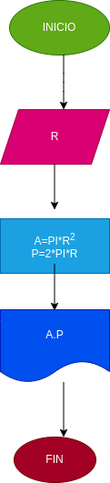

# Ejercicio No. 1

## Calcular el area y el perimetro de un circulo de radio R.

# Analisis

Variable de entrada (input)

R: Radio del circulo 

Variabes de proceso y salida (procesing, storage, output)

A: Area del circulo
P: perimetro del circulo 

# DISEÑO

# CONSTRUCCION

